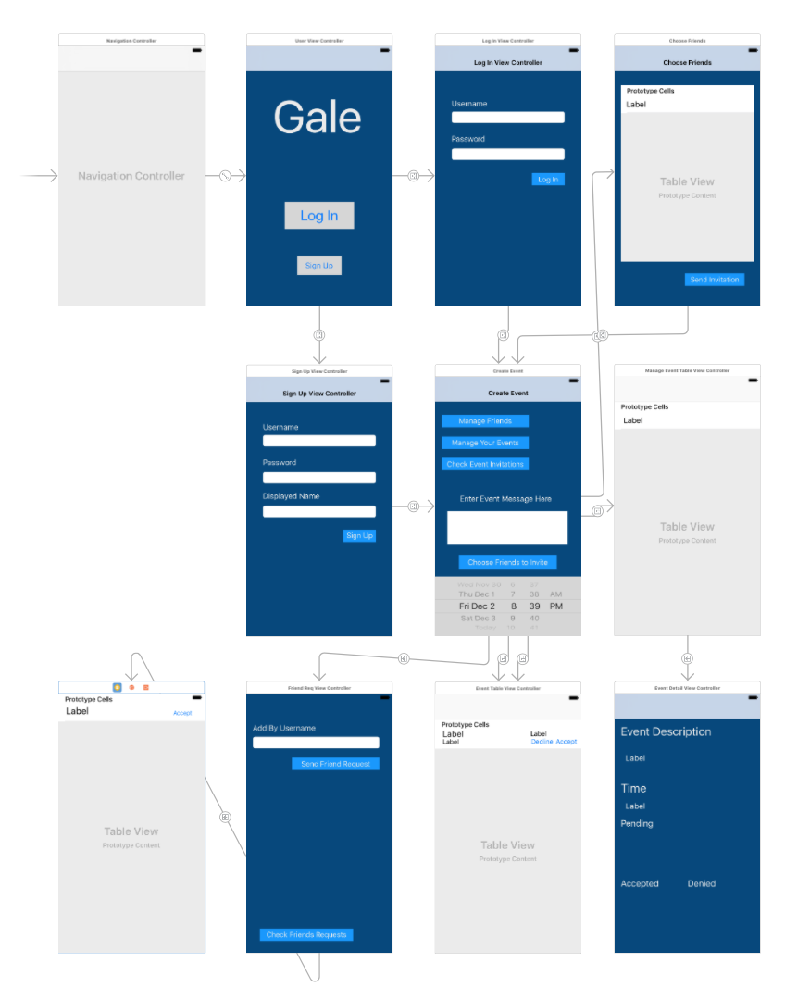
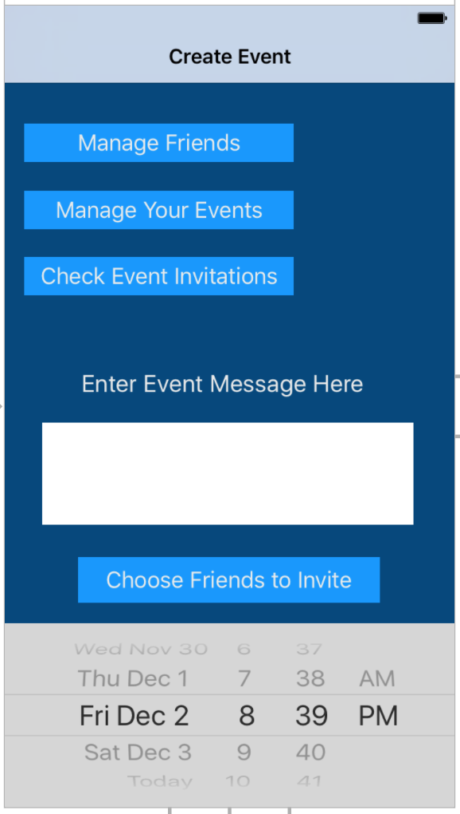

# Gale
A simple event scheduling app for busy people with changing schedules. Made by
[Christopher Fu](https://github.com/chrisf1337) (netid: cf449) and
[Ken Cheng](https://github.com/almighty-ken) (netid: kc792).

## Table of contents
1. [Introduction](#introduction)
2. [Example usage](#example-usage)
  1. [Frontend](#frontend)
  2. [Backend](#backend)
3. [Technical details](#technical-details)
4. [Application of concepts used in class](#application-of-concepts-learned-in-class)
5. [Who did what](#who-did-what)
6. [Difficulties](#difficulties)
  1. [Backend](#backend-1)
  2. [Frontend](#frontend-1)
7. [Other selling points](#other-selling-points)
8. [Future work](#future-work)

## Introduction
Gale is an application that helps people quickly organize events. Often times,
it is difficult to meet up with a group of friends on short notice. For example,
consider a situation where you are going to grab lunch in 30 minutes, and you
want to eat with somebody else, but you haven't made plans with anybody
specific. You would either have to message several friends individually, or if
you and your friends have a group message set up before hand, you could send a
message to that group. This is inconvenient for a few reasons:
  - Messaging everybody individually is a hassle.
  - Messaging a group notifies everybody in the group, not all of whom you may
    want to invite.
  - Invitees in the same group chat who do not want to go continue to receive
    notifications from the group chat.
  - It is difficult to coordinate time and place when everybody has different
    schedules.

With Gale, an event creator specifies where and when the event will occur. The
invite is then sent out to the friends that the event creator wants to invite.
Invitees must immediately respond to the invite with a simple tap. By
introducing an element of immediacy, we get rid of the problem where users
aren't sure if they want to attend the event, put off responding to the invite,
and eventually forget about it. This way, the event creator ideally gets a fast
and accurate indication of who and how many people will show up at his event and
can prepare.

In addition, there is no quibbling about the time and place: it is set in stone
beforehand, and the event owner cannot change it after the event is made. Gale
handles the invitation process for the user so he does not have to track each
invitee down. Invitees who decline an invitation will not receive any more
notifications about it.

## Example usage
### Backend
See the [README](README.md) for a complete description of all the current
implemented API endpoints.

To begin, we can create a new user by sending a POST request to `user`.

```http
POST /api/user HTTP/1.1
Host: localhost:4000
Content-Type: application/json

{
  "username": "chris",
  "password": "pass",
  "name": "chris"
}
```

We receive the following response:

```json
{
  "payload": {
    "user": {
      "username": "chris",
      "name": "chris",
    },
    "jwt": "eyJhbGciOiJIUzUxMiIsInR5cCI6IkpXVCJ9.eyJhdWQiOiJVc2VyOjkiLCJleHAiOjE
    0ODMzMzkxMzEsImlhdCI6MTQ4MDc0NzEzMSwiaXNzIjoiR2FsZVNlcnZlciIsImp0aSI6Ijc2ZGF
    lMGVkLTViNzEtNGU4Yy1iOGEyLThhZGQwNjQ0MmFiYiIsInBlbSI6e30sInN1YiI6IlVzZXI6OSI
    sInR5cCI6ImFjY2VzcyJ9.yWRaPPtmQn8jvvXHR3Tt6JSqt7CsU23jweujBKPSCoAgts-
    QCnj6YUSkStx58uSoTfzkezjpanahMJeDQT178A",
    "exp": 1483339131
  },
  "error": false
}
```

Using the JWT in the response, we can make authenticated requests. For example,
we can retrieve information about ourself.

```http
GET /api/user/chris HTTP/1.1
Host: localhost:4000
Content-Type: application/json
Authorization: JWT omitted for clarity

```

```json
{
  "payload": {
    "username": "chris",
    "rejected_events": [],
    "pending_events": [],
    "owned_events": [],
    "name": "chris",
    "friends": [],
    "accepted_events": []
  },
  "error": false
}
```

We can also lookup other users' info.

```http
GET /api/user/adam HTTP/1.1
Host: localhost:4000
Content-Type: application/json
Authorization: JWT omitted for clarity

```

```json
{
  "payload": {
    "username": "adam",
    "name": "adam"
  },
  "error": false
}
```

Note that we do not get to see all of adam's info because our JWT identifies us
as chris.

We can send a friend request to adam.

```http
POST /api/friendreq/ HTTP/1.1
Host: localhost:4000
Content-Type: application/json
Authorization: JWT omitted for clarity

{
  "username": "adam"
}
```

```json
{
  "payload": {
    "user": "chris",
    "inserted_at": "2016-12-05T01:46:30Z",
    "id": 2,
    "friend": "adam"
  },
  "error": false
}
```

We can check all of our friend requests.

```http
GET /api/friendreq HTTP/1.1
Host: localhost:4000
Content-Type: application/json
Authorization: JWT omitted for clarity

```

```json
{
  "payload": [
    {
      "user": "chris",
      "inserted_at": "2016-12-05T01:46:30Z",
      "id": 2,
      "friend": "adam"
    }
  ],
  "error": false
}
```

If we log in as adam, we can check that he sees the friend request as well.

```http
POST /api/login HTTP/1.1
Host: localhost:4000
Content-Type: application/json

{
    "username": "adam",
    "password": "adampass"
}

GET /api/friendreq HTTP/1.1
Host: localhost:4000
Content-Type: application/json
Authorization: JWT omitted for clarity

```

```json
{
  "payload": [
    {
      "user": "chris",
      "inserted_at": "2016-12-05T01:46:30Z",
      "id": 2,
      "friend": "adam"
    }
  ],
  "error": false
}
```

We can accept the friend request.

```http
DELETE /api/friendreq/2 HTTP/1.1
Host: localhost:4000
Content-Type: application/json
Authorization: JWT omitted for clarity

{
    "action": "accept"
}
```

```json
{
  "payload": {
    "user": "chris",
    "inserted_at": "2016-12-05T01:59:12Z",
    "friend": "adam"
  },
  "error": false
}
```

If we check our friends list now, we see that chris has been added as a friend.

```http
GET /api/friend HTTP/1.1
Host: localhost:4000
Content-Type: application/json
Authorization: JWT omitted for clarity

```

```json
{
  "payload": [
    {
      "username": "chris",
      "name": "chris",
      "inserted_at": "2016-12-03T18:11:46Z"
    }
  ],
  "error": false
}
```

Let's create a new event and invite chris.

```http
POST /api/event HTTP/1.1
Host: localhost:4000
Content-Type: application/json
Authorization: JWT omitted for clarity

{
    "description": "An event!",
    "time": "2016-12-06T01:00:00Z",
    "invitees": ["chris"]
}
```

```json
{
  "payload": {
    "time": "2016-12-06T01:00:00Z",
    "rejected_invitees": [],
    "pending_invitees": [
      {
        "username": "chris",
        "name": "chris"
      }
    ],
    "owner_name": "adam",
    "owner": "adam",
    "id": 4,
    "description": "An event!",
    "accepted_invitees": []
  },
  "error": false
}
```

Now, let's log back in as chris and accept the event.

```http
POST /api/login HTTP/1.1
Host: localhost:4000
Content-Type: application/json

{
    "username": "chris",
    "password": "pass"
}

PUT /api/event/4 HTTP/1.1
Host: localhost:4000
Content-Type: application/json
Authorization: JWT omitted for clarity

{
    "action": "accept"
}
```

```json
{
  "payload": {
    "time": "2016-12-06T01:00:00Z",
    "rejected_invitees": [],
    "pending_invitees": [],
    "owner_name": "adam",
    "owner": "adam",
    "id": 4,
    "description": "An event!",
    "accepted_invitees": [
      {
        "username": "chris",
        "name": "chris"
      }
    ]
  },
  "error": false
}
```

chris has been moved from the pending invitees list to the accepted invitees
list. You can verify that adam sees this change as well.

### Frontend
Below are some screenshots of the frontend in action.






## Technical details
Gale currently consists of two parts: the backend (uses Phoenix, a web framework
written in Elixir; backed by Postgres) by Postgres, and the frontend (an iOS
app).

Gale uses Ecto as a DB abstraction layer. Ecto allows use to define schemas for
our models, which then defines the kinds of queries and actions we can perform
with those models. Take, for example, the definition of the `Event` model:

```elixir
schema "events" do
  field :description, :string, default: ""
  field :time, Timex.Ecto.DateTime

  belongs_to :owner, User
  many_to_many :accepted_invitees, User, join_through: AcceptedEventUser
  many_to_many :pending_invitees, User, join_through: PendingEventUser
  many_to_many :rejected_invitees, User, join_through: RejectedEventUser
  timestamps()
end
```

We can define fields on our model for the event description and time. We can
also define relationships between our `Event` model and other models (in this
case, `User`s). `Event`s have a foreign key reference to the event owner, and
they also have a many-to-many relationship with invitees (also `User`s) through
three different join tables.

An ER diagram of Gale's entity model is shown below:


On the front end side, the iOS app is written in Swift 3, and makes asynchronous
calls to the back end to fetch the data we need. The json data returned by the
server are parsed by SwiftyJson, a package that makes json parsing a lot more
flexible in Swift. A modal is implemented to force the users to respond to a new
event invitation, thus facilitating the immediacy factor we want in Gale. We
want to make sure our users never ignore the invitation, and leave the event
host pending on the response. The app also supports friend management and event
reminders as notifications before the event starts.

## Application of concepts learned in class
- SQL queries
- Normalization
  - Join tables are used extensively
- Transactions

## Who did what
- Chris: Backend
- Ken: Frontend

## Difficulties
### Backend
We decided to use Elixir, a functional programming language, and Phoenix, a web
app framework for Elixir, to build the backend. Neither of us had experience
with Elixir before, so figuring out how to build the backend from scratch was
challenging.

Phoenix uses Ecto to handle database interactions. We found that most parts of
Ecto were pretty easy to use. For example, a simple join query can be written
much like an SQL join query. The code snippet shown below is a query for all
`Event`s that the `user` has accepted and whose time is in the future,
ordered by time. `AcceptedEventUser` is the schema of the join table relating
`User`s and `Event`s.

```elixir
Repo.all(from ev in Event,
  join: eu in AcceptedEventUser, on: ev.id == eu.event_id,
  join: u in User, on: u.id == eu.user_id,
  where: u.id == ^user.id and ev.time >= from_now(0, "second"),
  order_by: ev.time)
```

However, we had to do a little bit of messing with Ecto to express other types
of relationships. For example, in our `User` schema, to express friend and
friend request relationships, we had to add a dummy field to the `User` schema
since both types of relationships relate `User`s to `User`s.

```elixir
schema "users" do
  # Some code omitted...
  has_many :_friends, Friend  # dummy field
  has_many :friends, through: [:_friends, :friend]

  has_many :_friend_reqs, FriendReq  # dummy field
  has_many :friend_reqs, through: [:_friend_reqs, :friend]
  # Other code omitted...
```

It took a bit of time before we figured out this approach.

### Frontend
We talked about the different possibilities for the frontend of Gale, including
implementing as a web app, android app, iOS app, or using ReactNative. We chose
not to do it with a webapp mostly because one important feature of Gale is that
it should be very accessible and convenient, and an app is easier to use in most
cases. Since Chris has some experience in iOS development, we decided to write
the frontend with Swift.

One challenge is figuring out which thread an operation is supposed to be
executed on. For the following example, the function `ViewDidLoad()` calls
`load_events()` to fetch the list of events pending the user's response. The
request is executed in another thread, and updates the value of
`event_desc_list` and `event_id_list`. However, the part that we reload the data
so it can be correctly displayed in our table has to be executed in the main
thread; it turns out that all operations that is going to change the UI has to
be ran in the main thread, for example, segues also have to be performed in the
main thread.

```swift
func load_events(){
    // Some code omitted...

    let task_create = URLSession.shared.dataTask(with: request)
    { data, response, error in
        guard let data = data, error == nil else {
            print(error!)
            return
        }
        let response = JSON(data:data)
        if(response["error"]==true){
            print("load event fail")
        }else{
            let reqs = response["payload"]["owned_events"].arrayValue
            for sub:JSON in reqs{
                self.event_desc_list.append(sub["description"].string!)
                self.event_id_list.append(sub["id"].int!)
            }
            DispatchQueue.main.async {
                self.tableView.reloadData()
            }
        }
    }
    task_create.resume()
}
```

The `DispatchQueue.main.async` ensures that the `reloadData()` will be ran in
the main thread.

Another challenge is that even though Swift has a clear syntax to follow, it can
be really complicated when working with iOS. The target OS of Gale is iOS 10,
and it requires Swift 3. In Swift 3, a majority of OS APIs were renamed, and a
lot of them have different behavior comparing to Swift 2. This made debugging
hard sometimes, since many documentations on line are for Swift 1&2, we usually
have to try several times to get it working.

## Other selling points
- Our user entity is in BCNF. There are currently no restrictions on what a
  user can provide as his `name` (except for max length), so we cannot decompose
  a `name` into a first and last name. The normality of our event entity is a
  little bit ambiguous since we use `description` as a catchall for describing
  the event. Since description can contain information like location, it can be
  argued that our event entity is not in 1NF.

## Future work
Because of time constraints, we had to prioritize our current basic set of
features and leave out other features. We list a few things that we want to add
in the future below.
- Location awareness: Currently, events do not have a separate field for
  location. Users must specify the event location as part of the description. We
  should store event locations separately. If we also keep track of user
  locations, we could implement other features like inviting nearby friends to
  events.
- Push notifications: In the frontend, we currently poll for new events. We
  should send a push notification to all invitees when a new event is created.
- Transactions: Ecto allows us to group database operations together in a
  transaction. We should take advantage of this.
- Event canceling by the owner: The owner should be able to cancel an event.
  This change should also be pushed to all the participants to notify them.
- Map support: Once location-aware events are implemented, we can integrate map
  views into our front end to provide a friendlier interface for users.
